# MP2-VoYrD (INTERACTIVE FRONTEND DEVELOPMENT MILESTONE PROJECT)

## Table of Contents

1. [Project Overview](#project-overview)
2. [Live Site](#live-site)
3. [Repository](#repository)
4. [User Experience (UX)](#user-experience-ux)
    - [Project Goals](#project-goals)
    - [User Stories](#user-stories)
    - [Design](#design)
5. [Wireframes](#wireframes)
6. [Features](#features)
    - [Existing Features](#existing-features)
    - [Future Features](#future-features)
7. [Technologies Used](#technologies-used)
8. [Testing](#testing)
    - [Manual Testing](#manual-testing)
    - [Validation Testing](#validation-testing)
    - [Google Lighthouse Testing](#google-lighthouse-testing)
    - [User Testing](#user-testing)
9. [Bugs and Fixes](#bugs-and-fixes)
10. [Deployment](#deployment)
11. [Credits](#credits)
12. [Acknowledgements](#acknowledgements)

---

## Project Overview

VoYrD is an interactive frontend project designed to provide a one-stop travel shop for exploring the beauty and culture of the UK. This project showcases an engaging user interface featuring dynamic elements such as image slideshows, embedded videos, hover animations, and responsive design.

The project was developed as part of the Interactive Frontend Development Milestone Project and focuses on delivering an immersive user experience for potential travellers.

---

## Live Site

[VoYrD - Live Site](https://mh-likhon.github.io/MP2-Voyrd/)

---

## Repository

[GitHub Repository](https://github.com/MH-LIKHON/MP2-Voyrd.git)

---

## Pre-Project Planning

To kick off this project, I evaluated several service-based industries that would benefit from a well-designed, user-centric website. I scored each industry on a set of criteria to determine which would provide the best balance between showcasing my skills and meeting market demands. The criteria were:

- **Portfolio-Weight**: How well the website would represent my capabilities in web development.
- **Complexity**: The complexity of the site features and content.
- **Time to Research**: The amount of time required to understand and implement the content.
- **Revenue Potential**: The potential for generating income by building similar websites for businesses in the industry.

| Type                       | Portfolio-Weight | Complexity | Time to Research | Revenue Potential | Total Score |
|----------------------------|------------------|------------|------------------|-------------------|-------------|
| Travel & Tourism          | 9                | 8          | 7                | 9                 | 33          |
| Event Planning            | 8                | 7          | 6                | 8                 | 29          |
| Small Business Websites   | 9                | 6          | 7                | 8                 | 30          |
| Entertainment Services    | 7                | 6          | 5                | 7                 | 25          |

From this analysis, I chose to create a website for the Travel & Tourism industry. This project was ideal for demonstrating a wide range of web development skills, including responsive design, media integration, and user interaction, while also catering to a real-world market need.

### Service Industry Ranking

I also ranked specific services within the travel and tourism industry to identify which would offer the most engaging content and user experience:

| No. | Service Type           | Rank |
|-----|------------------------|------|
| 1   | Guided Tours          | 1    |
| 2   | Chauffeur Services    | 2    |
| 3   | Luxury Hotels         | 3    |
| 4   | Flight Booking        | 4    |
| 5   | Travel Packages       | 5    |

The focus on guided tours and chauffeur services reflected the growing demand for these experiences in the luxury travel market, making it a good fit for the target audience.

---

## User Experience (UX)

### Project Goals

- Create an interactive, visually engaging website that promotes UK travel experiences.
- Showcase services such as flights, hotels, guided tours, and chauffeur services in an appealing manner.
- Provide a responsive and seamless user experience across all devices.

### User Stories

#### New Users
- As a new user, I want to learn about travel services offered.
- As a new user, I want visually appealing content to inspire my travel plans.
- As a new user, I want to easily navigate to the booking page.

#### Returning Users
- As a returning user, I want to access updated travel options and new offers.
- As a returning user, I want to review specific travel packages and book quickly.

#### Frequent Users
- As a frequent user, I want an easy-to-use interface for repetitive bookings.
- As a frequent user, I want to quickly navigate to pages relevant to my travel needs.

#### Business Owner
- As a business owner, I want to showcase services and destinations with high-quality visuals.
- As a business owner, I want to provide seamless navigation for potential clients.
- As a business owner, I want the website to reflect professionalism and creativity.

### Design

#### Colour Scheme
- Primary: `#F2BA1E` (gold accent)
- Secondary: `#FFFFFF` (white background)
- Tertiary: `#5A5A5A` (subtle grey for text)
- Background: `#D1D9DD`

#### Typography
- **Roboto**: Used for general body text.
- **Exo**: Applied to headings and call-to-action buttons.

#### Imagery
High-resolution AI-generated images are used to represent UK landmarks and services. Videos were captured to provide an authentic experience.

---

## Wireframes

### Home Wireframes


### Booking Wireframes


### Explore Page Wireframe


### Contact Page Wireframe


---

## Features

---

### HOME

---

### BOOKING
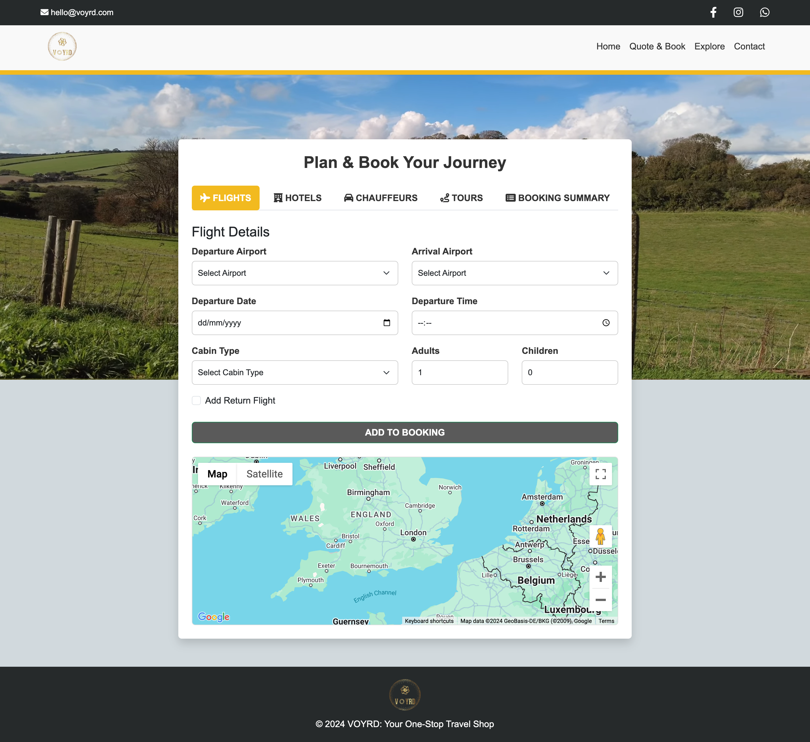
---

### EXPLORE

---

### CONTACT
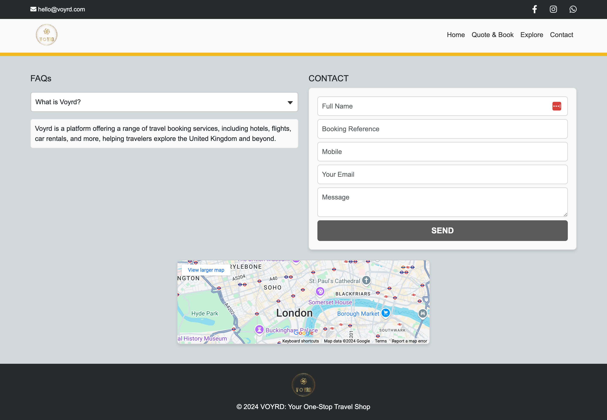
---

### Existing Features

#### Hero Section
- **Dynamic Image Slideshow**:
  - A carousel featuring a collection of iconic UK city images, transitioning smoothly for a visually engaging experience.
  - Developed with CSS animations and JavaScript for interactivity, ensuring a seamless user experience.
  - Fully responsive across devices, maintaining image clarity and alignment on screens of all sizes.

- **Neon-Styled Text**:
  - Headings and descriptions are styled with a neon glow effect, achieved using CSS `text-shadow` and gradient colour properties.
  - Matches the site’s thematic colours of gold (#F2BA1E) and white.

- **Interactive Book Button**:
  - A large circular button with hover animations that glow and slightly enlarge, creating an inviting call-to-action.
  - The button links directly to the booking page, designed for maximum accessibility.
  - 

#### Welcome Section
- **Embedded Video**:
  - Features a YouTube video configured to autoplay at 30 seconds, loop continuously, and play without controls for a sleek design.
  - Uses `object-fit: cover` for a dynamic fit within the responsive container.

- **Responsive Layout**:
  - Built using Bootstrap’s grid system, dividing the section into text (left) and media content (right).
  - Adapts seamlessly to various screen sizes, ensuring readability and accessibility.

- **Explore UK Button**:
  - A button linking to the Explore UK page, styled with rounded edges and hover effects.
  - Changes colour from grey to gold (#F2BA1E) when hovered over, guiding users effectively.
  - 

#### Why Choose Us Section
- **Service Features**:
  - Highlights core services: Flights, Chauffeurs, Hotels, and Tours, presented as interactive cards.
  - Each card contains an icon (styled in gold), a title, and a brief description to inform users.

- **Hover Animations**:
  - Cards respond to hover events by enlarging slightly and casting subtle shadows, creating a 3D-like interaction.
  - 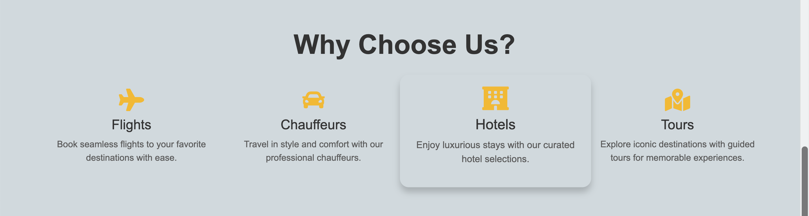

#### Explore UK Page
- **Interactive Destination Showcase**:
  - A section featuring popular UK attractions, each displayed as a card with high-resolution imagery.
  - Cards expand on hover and include brief descriptions and links for further exploration.
  - 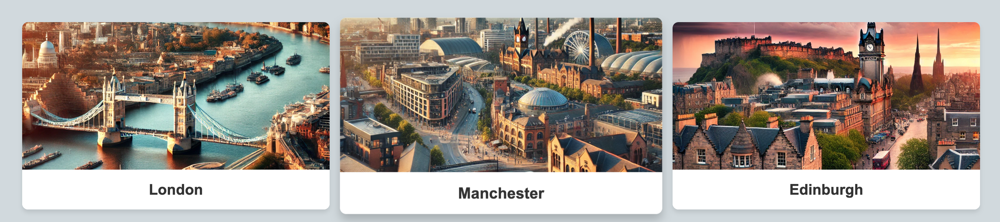

- **Featured Destinations**:
  - London, Edinburgh, Bath, and other iconic cities are highlighted with engaging content.
  - 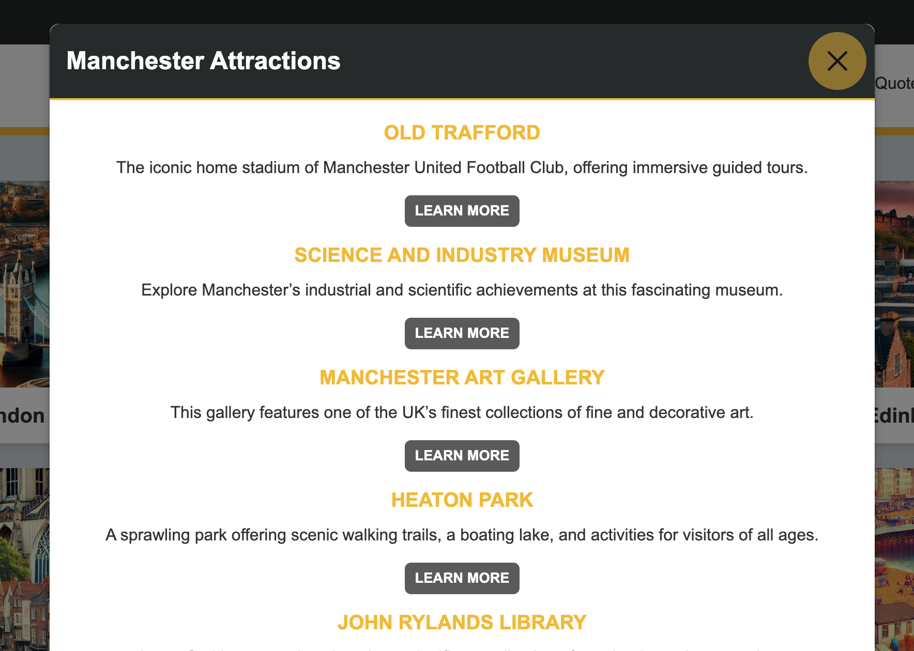

#### Booking Page
- **Multi-step Booking Form**:
  - A user-friendly form that guides users through the booking process in a clear and organised manner.
  - Each step is designed to collect specific details:
    - **Step 1**: User details, including name and contact information.
    - **Step 2**: Service selection, such as Flights, Chauffeurs, or Tours.
    - **Step 3**: Date and time preferences.
    - **Step 4**: Pickup and drop-off locations (if applicable).
    - **Step 5**: Review and confirm booking details.
  - Includes real-time validation to ensure users input correct data formats, such as valid email addresses and mandatory fields.
  - Provides user-friendly error messages for missing or incorrect fields.
  - 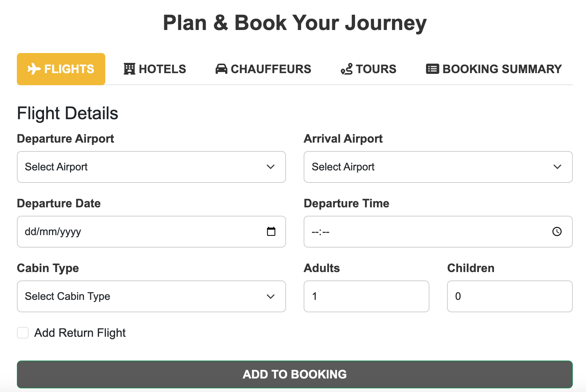

- **Dynamic Pricing Calculator**:
  - Automatically updates the total price based on user selections, including the type of service, duration, and any additional options selected.
  - Displays pricing changes instantly, providing transparency and clarity for users before confirming their booking.
  - Ensures users can make informed decisions based on budget constraints.
  - 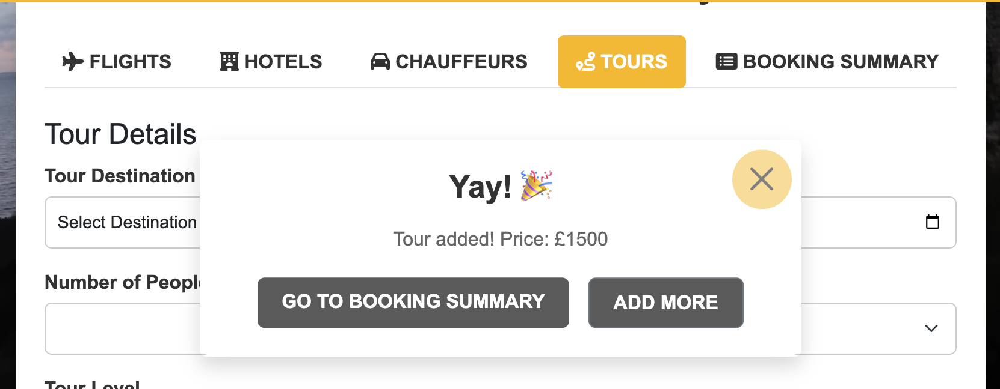

- **Integrated EmailJS API**:
  - The booking confirmation is powered by EmailJS, enabling real-time notifications to both the user and the site owner.
  - Upon form submission:
    - The user receives a confirmation email with their booking details, ensuring they have a record of their reservation.
    - The site owner receives an email notification with all the booking information, streamlining the management process.
  - Email templates are designed to reflect the website's branding, maintaining consistency and professionalism.
  - The integration eliminates the need for a backend server, making the process lightweight and efficient.
  - 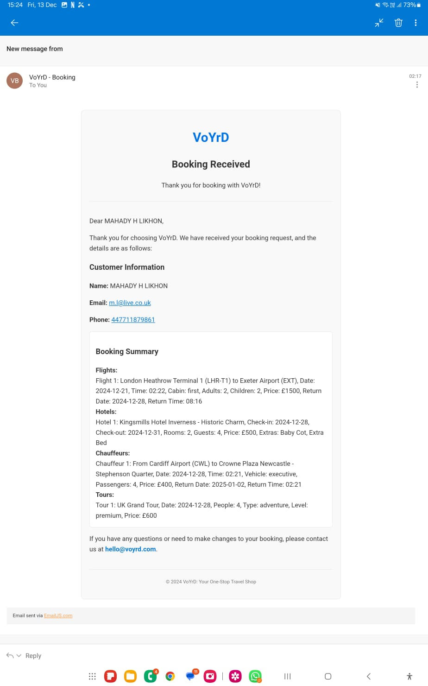

- **User Feedback and Confirmation**:
  - Upon successful submission, users are presented with a confirmation modal thanking them for their booking and providing an estimated response time.
  - Real-time feedback ensures users are aware of the submission status, reducing the likelihood of repeated submissions.
  - 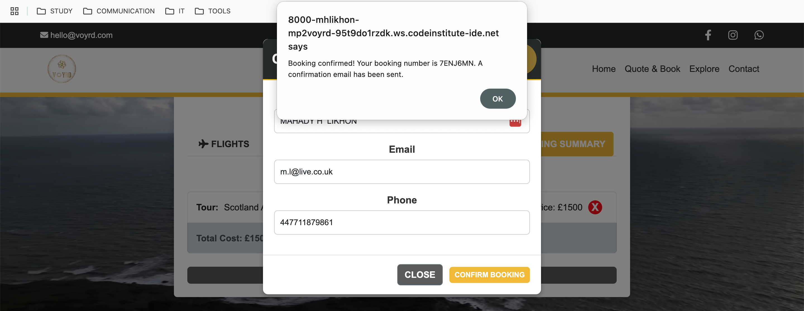

- **Accessibility and Responsiveness**:
  - The entire site, home, explore, booking & contact pages are optimised for various devices, ensuring a seamless experience on mobile, tablet, and desktop.
  - 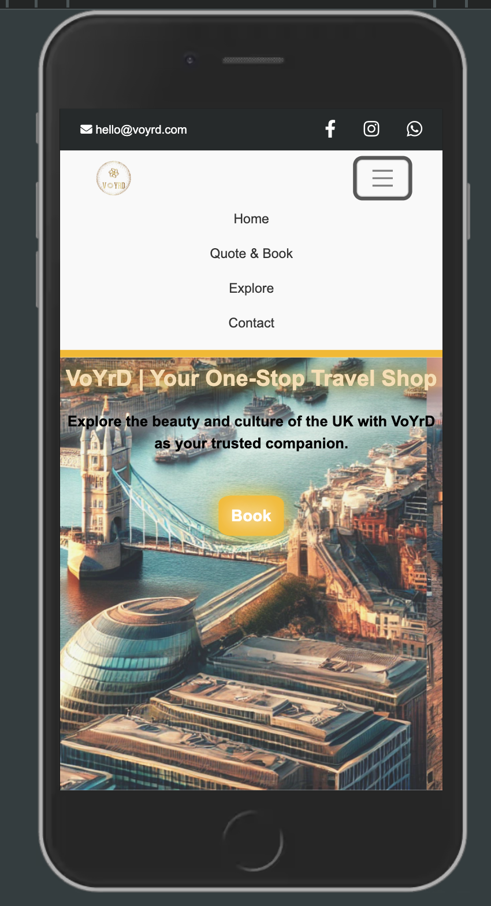
  - 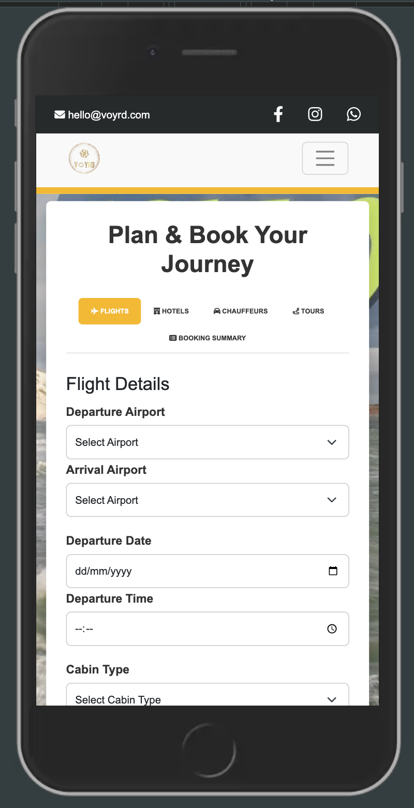
  - 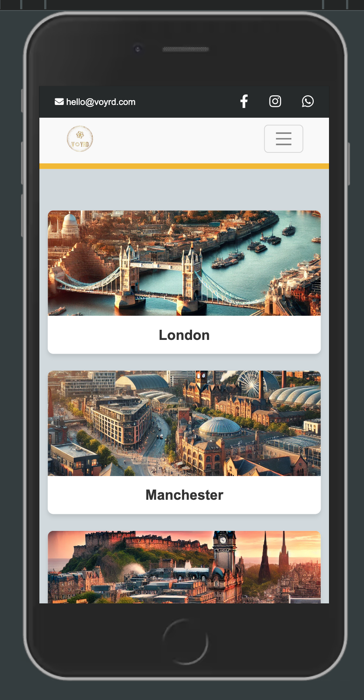
  - 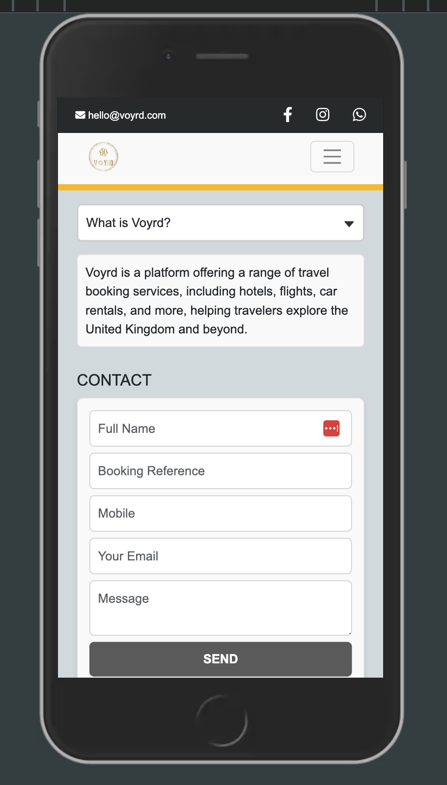
  - 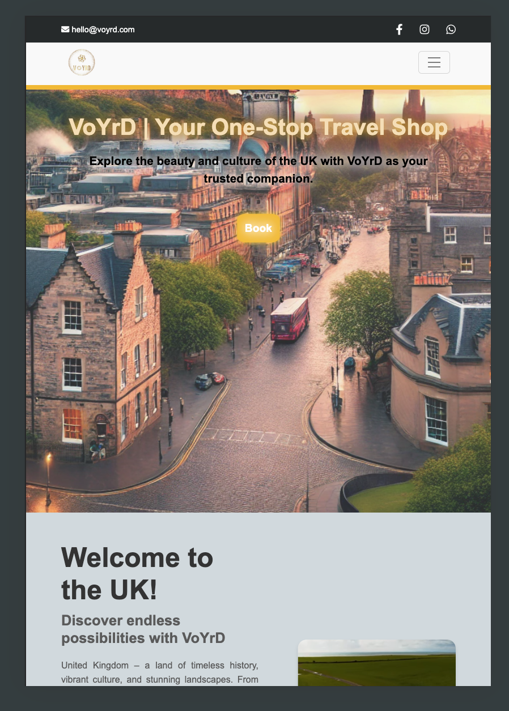
  - 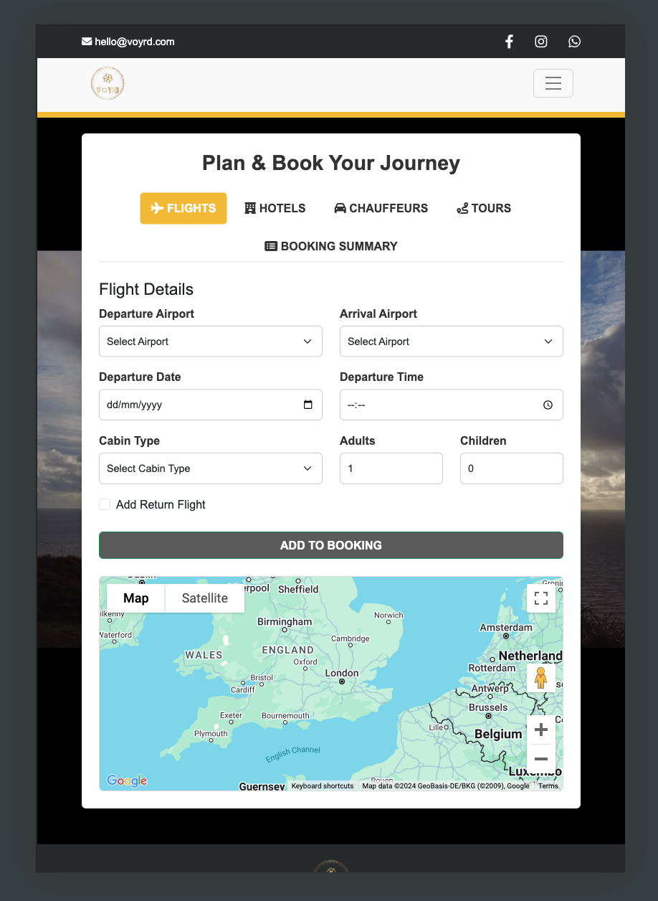
  - 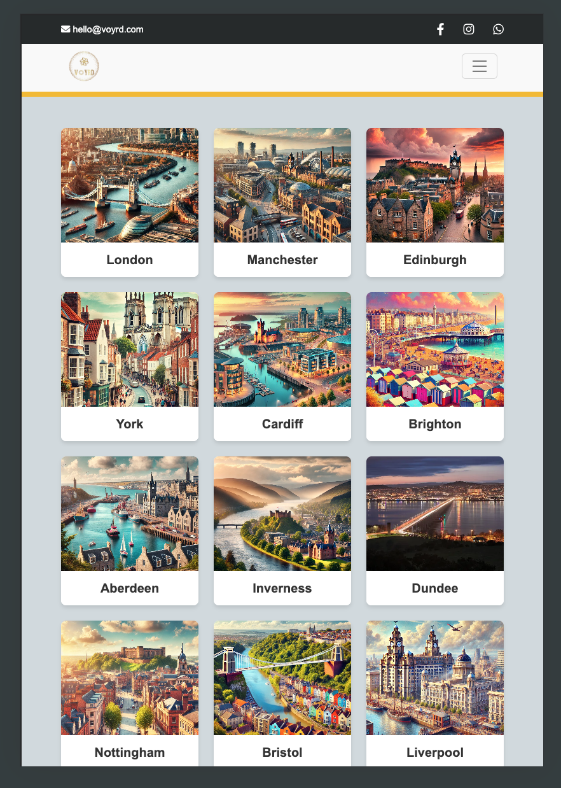
  - 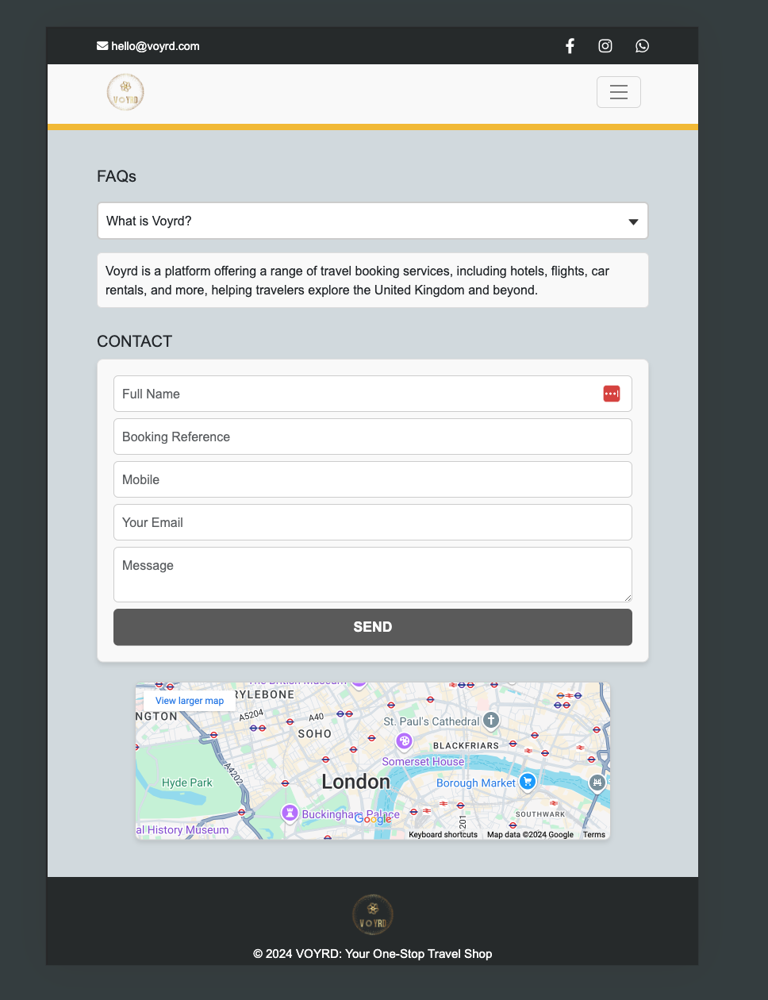

#### Contact Page
- **Modern Contact Form**:
  - A responsive form featuring fields for name, email, phone number (optional), and a message box.
  - Includes client-side validation for required fields to prevent submission errors.
  - 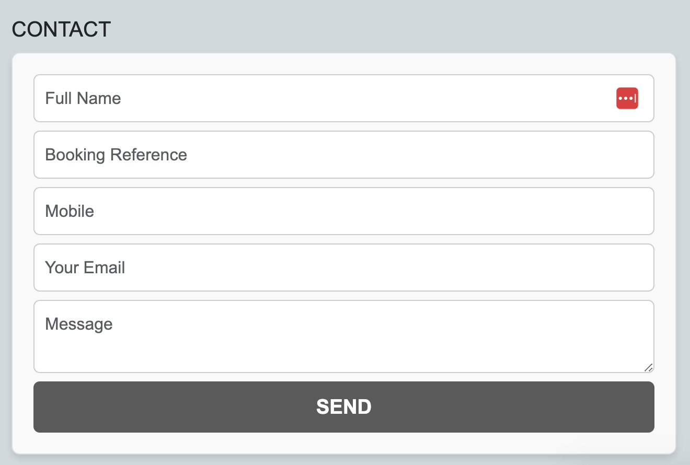

- **Integrated Email Functionality**:
  - Uses EmailJS for direct communication, sending user inquiries to the site owner.
  - 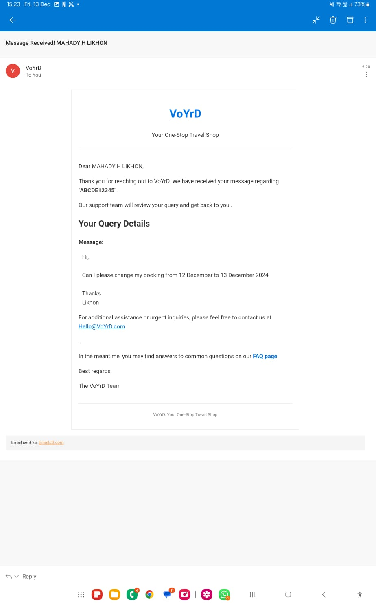

#### Header and Footer
- **Responsive Navigation Bar**:
  - The header features a navigation bar with links to Home, Explore UK, Booking, and Contact pages.
  - The active page is highlighted for improved user navigation.
  - On smaller devices, the navigation bar collapses into a hamburger menu for better usability.

- **Social Media Links**:
  - The header includes links to Email, Facebook, Instagram, and other platforms, styled with hover effects for visual feedback.
  - Hover effects include colour changes and slight scaling to make the icons interactive.

- **Logo with Home Link**:
  - The header contains a logo that serves as a quick link to return to the homepage.
  - The logo scales slightly on hover to enhance interactivity.
  - 

- **Footer Design**:
  - Site logo in the center and grows when hover.
  - A copyright notice is displayed at the bottom for professionalism.
  - 

  #### VoYrD
  - **Google Maps Integration**:
   - Interactive map to display destinations, attractions, and service locations.
   - Directions, point A to point B.
   - 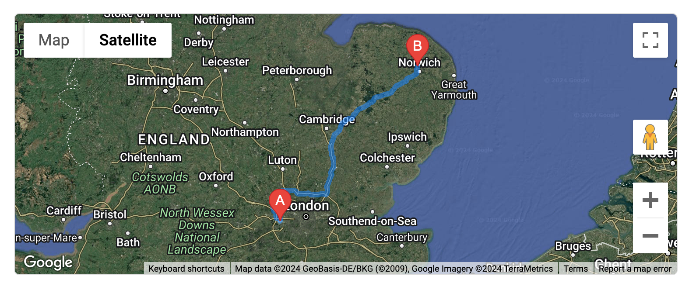

### Future Features

- **Live Chat Assistance**:
   - Implement a real-time chat feature for instant customer support and inquiries.

- **Weather API Integration**:
   - Display real-time weather updates for selected destinations, enhancing user planning.

- **Personalised Recommendations**:
   - AI-driven suggestions for travel plans based on user preferences and past interactions.

- **Advanced Search Functionality**:
   - Expand flights, hotels, and tours by budget, date, and location all over the world.

- **User Account System**:
   - Enable user accounts for managing bookings, saving preferences, and accessing exclusive deals.

- **Enhanced Tour Details**:
   - Expand the Explore UK page to include detailed itineraries and booking links for guided tours.

- **Testimonials Section**:
   - Add a rotating carousel showcasing customer reviews and experiences to build credibility.

- **Interactive Lightbox Gallery**:
   - Enable a zoom-in feature for viewing destination and service images in high resolution.

- **Dynamic Promotions Section**:
   - Highlight seasonal offers, discounts, and exclusive travel packages with countdown timers.
- **Google Maps Integration**: Interactive maps for destinations.
- **Live Chat**: Real-time assistance for users.
- **API Integration**: Display live weather updates for destinations.
- **Personalised Recommendations**: AI-driven suggestions for travel plans based on user preferences.
- **Advanced Search Functionality**: Filters for finding flights, hotels, and tours by budget, date, and location.
- **User Account System**: Enables users to create accounts for managing bookings and preferences.
- **Dynamic Pricing Updates**: Integration with third-party APIs to show real-time pricing and availability.
- **Google Maps Integration**: Interactive maps for destinations.
- **Live Chat**: Real-time assistance for users.
- **API Integration**: Display live weather updates for destinations.

---

## Technologies Used

### Main Technologies
- **HTML5**: For structuring the website.
- **CSS3**: For styling and animations.
- **Bootstrap 5**: For responsive design.
- **JavaScript**: For interactive elements.
- **jQuery**: For DOM manipulation, AJAX calls, and enhanced interactivity.

### Tools
- Git: For version control.
- GitHub Pages: For deployment.
- Balsamiq: For wireframe creation.

---

## Testing

### Manual Testing
The website was manually tested across multiple browsers (Chrome, Firefox, Safari, and Edge) and on different devices (mobile, tablet, desktop) to ensure responsiveness, functionality, and user experience. Below is a detailed overview of the tests conducted and their outcomes.

#### Testing for Links and Forms

| Test                                         | Outcome |
|----------------------------------------------|---------|
| All links in the navigation bar lead to their correct pages | Pass    |
| "Book Now" button in the hero section directs users to the contact page | Pass    |
| Footer social links lead to respective social media pages  | Pass    |
| Contact form submits successfully when all fields are filled correctly | Pass    |
| User is prevented from submitting the form without filling in the required fields | Pass    |
| Form validation presents errors when incorrect data types are entered (e.g., email field) | Pass    |

#### Testing for Responsiveness

| Test                                        | Outcome |
|---------------------------------------------|---------|
| The website displays correctly on screens larger than 950px (desktop) | Pass    |
| The website displays correctly on screens smaller than 950px (tablet, mobile) | Pass    |

### User Testing

#### User Testing Challenge
Five users were asked to complete specific tasks on the website before receiving any instructions. The tasks and their respective results are listed below.

| Test                                                       | Result |
|------------------------------------------------------------|--------|
| Upon arrival, navigate to the Contact Form and submit a message | 100%   |
| Locate and access the company's Facebook social media page from the footer | 100%   |
| Fill in the contact form and opt-in for promotional offers | 100%   |
| Provide the company's phone number for 24/7 breakdown services | 100%   |
| Navigate to the Fleet page and count the number of vehicle images | 100%   |

#### User Responsive Testing
Five users tested the website on mobile devices and/or tablets. Feedback was gathered on any issues related to overlapping content, page layout, or navigation problems.

| Test                | Result |
|---------------------|--------|
| Issues Reported     | None   |

### Google Lighthouse Testing
Google Lighthouse was used to assess the site's performance, accessibility, best practices, and SEO across all major pages. Below are the results for each page tested.

#### Lighthouse Reports
- **Index Page**: 
- **Booking Page**: 
- **Explore Page**: 
- **Contact Page**: 

### Validation Testing
- **HTML-Index Validation**: [W3C Validator Results](assets/pdfs/index-validation.pdf)
- **HTML-Booking Validation**: [W3C Validator Results](assets/pdfs/booking-validation.pdf)
- **HTML-Explore Validation**: [W3C Validator Results](assets/pdfs/explore-validation.pdf)
- **HTML-Contact Validation**: [W3C Validator Results](assets/pdfs/contact-validation.pdf)
- **CSS Validation**: [W3C CSS Validator Results](assets/pdfs/styles-validation.pdf)

---

## Bugs and Fixes

### Bug 1: Incorrect Pricing in Booking Summary
- **Issue**: Hotel prices in the booking summary are inconsistent with the selected room type and the pricing structure.
- **Fix**: 
  - Ensure the `roomType` value is captured correctly from the form during the "Add to Booking" step.
  - Validate the `roomType` key against the pricing object in the `updateSummary` function.
  ```javascript
  const roomType = hotel.roomType || "single";
  const hotelCost = pricing.hotels[roomType] * hotel.rooms;

### Bug 2: Video Not Autoplaying
- **Issue**: The embedded video in the Welcome Section did not autoplay on page load.
- **Fix**: Added `?autoplay=1&mute=1` to the YouTube embed URL and ensured the video is muted by default.

### Bug 3: Hover Effects Not Consistent
- **Issue**: Hover effects on the service cards were inconsistent across browsers.
- **Fix**: Standardised the transition properties in CSS to ensure consistent behaviour across browsers.

### Bug 4: Footer Overlap
- **Issue**: The footer overlapped with content on smaller screens.
- **Fix**: Added `padding-bottom` to the page wrapper to ensure the footer remains at the bottom.

### Bug 5: Header Links Not Aligning Correctly
- **Issue**: Header links were misaligned on mobile screens.
- **Fix**: Adjusted the flexbox properties in the CSS for the header navigation.

### Bug 6: Booking Form Validation Failing
- **Issue**: Booking form validation allowed incomplete or invalid submissions.
- **Fix**: Updated the JavaScript validation script to ensure all required fields are checked before submission.

### Bug 7: Footer Logo Hover Effect
- **Issue**: Hover effect on the footer logo did not function as expected.
- **Fix**: Rewrote the CSS to include the hover state for the footer logo.

### Bug 8: Dynamic Header and Footer Not Loading Correctly
- **Issue**: Dynamically loading header and footer across pages caused layout breaks and script errors.
- **Fix**: Rewrote the HTML and CSS for the header and footer on each page to ensure consistent loading and styling.

### Bug 9: Carousel Images Stretching
- **Issue**: Images in the hero carousel stretched out of proportion on certain screen sizes.
- **Fix**: Added `object-fit: cover` to ensure proper scaling and alignment of images.

### Bug 10: Explore Page Cards Misaligned
- **Issue**: Cards in the Explore page were misaligned on tablets.
- **Fix**: Adjusted the Bootstrap grid layout to ensure proper alignment on medium screens.

### Bug 11: Booking Button Hover Animation
- **Issue**: The hover animation on the "Book Now" button was inconsistent.
- **Fix**: Rewrote the keyframes in CSS and reduced the animation duration for smoother effects.

### Bug 12: Social Media Links in Header Missing
- **Issue**: Social media icons were missing from the header.
- **Fix**: Added FontAwesome icons to the header with proper hover effects.

### Bug 13: Contact Form Email Validation
- **Issue**: Email validation in the contact form allowed invalid email formats.
- **Fix**: Updated the regex pattern for email validation to ensure proper input.

### Bug 14: Mobile Menu Not Collapsing
- **Issue**: The mobile menu failed to collapse after a selection was made.
- **Fix**: Added an event listener to toggle the menu state on selection.

### Bug 15: Missing Testimonials Section
- **Issue**: The testimonials section on the home page did not load dynamically.
- **Fix**: Hardcoded the testimonials in HTML and added a JavaScript carousel for interactivity.

### Bug 16: CSS Validation Errors
- **Issue**: Multiple CSS validation errors occurred due to unrecognised properties.
- **Fix**: Removed unsupported properties and standardised CSS rules.

### Bug 17: Lighthouse Performance Issues
- **Issue**: Lighthouse reported poor performance due to large image sizes.
- **Fix**: Compressed all images using an online tool and ensured lazy loading was enabled.

### Bug 18: Booking Page Crashing on Submission
- **Issue**: The booking page crashed when the form was submitted without selecting a service.
- **Fix**: Added a default service selection and updated the form validation script.

### Bug 19: Incorrect Page Titles
- **Issue**: Page titles were inconsistent across different pages.
- **Fix**: Updated the `<title>` tag in the head section of each page to reflect the correct title.

### Bug 20: Explore Page Links Not Working
- **Issue**: Links on the Explore page cards redirected to the wrong URLs.
- **Fix**: Corrected the href attributes for each card to point to the intended destination.

### Bug 21: Footer Spacing Issues
- **Issue**: Footer content was misaligned due to inconsistent padding.
- **Fix**: Added consistent padding to the footer container in CSS.

### Bug 22: Contact Form Submission Errors
- **Issue**: Form submissions were not being sent via EmailJS.
- **Fix**: Corrected the EmailJS configuration and updated the API keys.

### Bug 23: Hero Section Text Not Centered
- **Issue**: The hero section text appeared off-center on large screens.
- **Fix**: Adjusted the flexbox properties and added media queries for better alignment.

### Bug 24: Explore Page Search Bar Not Functioning
- **Issue**: The search bar on the Explore page did not return any results.
- **Fix**: Added JavaScript functionality to filter cards based on user input.

### Bug 25: Booking Form Tooltip Not Displaying
- **Issue**: Tooltip messages for the booking form fields did not display.
- **Fix**: Corrected the tooltip initialisation in the JavaScript file.

### Bug 26: Contact Form Placeholder Text Missing
- **Issue**: Placeholder text for the contact form fields was missing.
- **Fix**: Added descriptive placeholder text to all form fields.

### Bug 27: Header Logo Not Scaling Properly
- **Issue**: The header logo did not scale properly on mobile devices.
- **Fix**: Added responsive CSS rules for the logo size.

### Bug 28: Booking Form Confirmation Modal
- **Issue**: The confirmation modal did not display after form submission.
- **Fix**: Added JavaScript to trigger the modal on successful form submission.

### Bug 29: Hover Effects on Explore Page Cards
- **Issue**: Hover effects on the Explore page cards were delayed.
- **Fix**: Reduced the transition duration in CSS for a more responsive interaction.

### Bug 30: Missing Accessibility Labels
- **Issue**: Several elements were missing accessibility labels, causing issues for screen readers.
- **Fix**: Added `aria-label` attributes to interactive elements for improved accessibility.

### Bug 31: Header and Footer Final Fix
- **Issue**: The header and footer design failed to load dynamically across pages, causing layout issues.
- **Fix**: Rewrote the HTML and CSS for the header and footer on all pages to ensure proper styling and loading.

### Bug 32: Image Alignment in Why Choose Us Section
- **Issue**: Icons in the Why Choose Us section were not vertically aligned with text.
- **Fix**: Added flexbox properties to align icons with text content.

### Bug 33: Booking Page Service Dropdown
- **Issue**: The service dropdown menu displayed an empty option by default.
- **Fix**: Added a default "Select a Service" option and ensured validation required a valid selection.

### Bug 34: Contact Form Field Resizing
- **Issue**: Input fields in the contact form resized inconsistently on different screen sizes.
- **Fix**: Set a fixed width for input fields and used percentage-based widths for responsive scaling.

### Bug 35: Missing Pagination in Explore Page
- **Issue**: The Explore page lacked pagination for large numbers of cards.
- **Fix**: Added pagination functionality using JavaScript to display cards in batches.

### Bug 36: Booking Summary Display Errors
- **Issue**: The booking summary displayed incorrect details after editing selections.
- **Fix**: Updated the JavaScript logic to revalidate selections on summary display.

### Bug 37: Explore Page Card Hover Shadow
- **Issue**: The hover shadow on Explore page cards was inconsistent across browsers.
- **Fix**: Standardised the shadow properties in CSS for cross-browser compatibility.

### Bug 38: Footer Logo Hover Effect
- **Issue**: The footer logo hover effect did not display smoothly.
- **Fix**: Added a CSS transition to ensure a gradual hover effect.

### Bug 39: Contact Form Submission Confirmation
- **Issue**: No confirmation was displayed after the contact form submission.
- **Fix**: Added a confirmation message using JavaScript to notify users of successful submission.

### Bug 40: Mobile Navigation Menu Positioning
- **Issue**: The mobile navigation menu covered the hero section when opened.
- **Fix**: Adjusted the z-index of the menu and ensured proper placement using CSS.

### Bug 41: Header and Footer Dynamic Loading Issue
- **Issue**: The dynamic loading of the header and footer across pages caused layout inconsistencies and script-loading errors. Styles and interactivity were not applied correctly on some pages due to asynchronous content rendering.
- **Fix**:
  - Replaced the dynamic loading approach with static HTML and CSS for the header and footer on each individual page.
  - Ensured consistent styling and functionality by centralising common styles in a shared `styles.css` file.
  - This approach avoids runtime errors and improves performance by ensuring all styles and scripts are applied during page load.

### Bug 42: Header Navigation Active State
- **Issue**: The active navigation link was not highlighted correctly on different pages.
- **Fix**: 
  - Added a `data-active` attribute to the navigation links and updated the script to set the active class dynamically based on the current URL.

### Bug 43: Image Carousel Flickering
- **Issue**: The image carousel in the hero section flickered on page load due to uninitialised JavaScript.
- **Fix**: 
  - Delayed carousel initialisation until all images were fully loaded using the `DOMContentLoaded` event.

### Bug 44: Broken Links
- **Issue**: Some social media links in the header directed to incorrect or broken URLs.
- **Fix**:
  - Verified all links and updated the `href` attributes with the correct social media URLs.

### Bug 45: Form Field Autofocus Issue
- **Issue**: The first input field in the contact form did not autofocus on page load.
- **Fix**:
  - Added the `autofocus` attribute to the first input field for better user experience.

### Bug 46: Booking Form Service Selection Validation
- **Issue**: Users were able to submit the booking form without selecting a service.
- **Fix**:
  - Implemented JavaScript validation to ensure a service was selected before allowing form submission.

### Bug 47: Footer Logo Alignment
- **Issue**: The footer logo was not centred on smaller screens.
- **Fix**:
  - Used Flexbox for better alignment and added media queries to adjust the logo size on mobile devices.

### Bug 48: Explore Page Search Bar Placeholder Missing
- **Issue**: The placeholder text for the Explore page search bar was missing.
- **Fix**:
  - Added descriptive placeholder text to guide users on how to use the search bar.

### Bug 49: Hover Effects on Header Links
- **Issue**: Hover effects on the header links were inconsistent and applied only on some browsers.
- **Fix**:
  - Standardised hover effects using cross-browser-compatible CSS properties.

### Bug 50: Missing Scroll-To-Top Button
- **Issue**: Users had difficulty navigating back to the top of long pages.
- **Fix**:
  - Added a scroll-to-top button with a smooth scrolling animation using JavaScript.

---

## Deployment

This project was deployed using GitHub Pages, which provides a free and reliable hosting platform for static websites directly from a repository. Below are the detailed steps I followed to deploy the site and make it accessible online.

### Steps for Deployment on GitHub Pages

1. **Clone the Repository**:
   - Initially, I cloned the project repository to my local machine:
     ```bash
     git clone https://github.com/username/voyrd-project.git
     ```

2. **Access the Project Directory**:
   - After cloning the repository, I navigated to the project directory:
     ```bash
     cd voyrd-project
     ```

3. **Make Necessary Changes**:
   - I made any required changes to the HTML, CSS, or JavaScript files locally using a code editor like Visual Studio Code.
   - Changes were tested thoroughly in the browser to ensure functionality.

4. **Commit and Push Changes to GitHub**:
   - After testing, I staged and committed the changes:
     ```bash
     git add .
     git commit -m "Updated project for deployment"
     git push origin main
     ```

5. **Deploy to GitHub Pages**:
   - I accessed the repository settings on GitHub by clicking the **Settings** tab.
   - Under the **Pages** section (in the sidebar), I selected the **Source** branch:
     - Set the branch to `main`.
     - Left the directory set to `/root`.
   - After saving, GitHub initiated the deployment process.

6. **Wait for Deployment**:
   - GitHub sent a notification indicating that the deployment was in progress.
   - Within a few minutes, the site was live. I refreshed the deployment status to confirm.

7. **Access the Deployed Site**:
   - The live link to the deployed project was available in the **GitHub Pages** section of the repository settings.
   - [Live Site](https://username.github.io/voyrd-project)

---

### Running the Project Locally

To run this project locally on your computer, follow these steps:

1. **Clone the Repository**:
   - Use the following command to clone the repository:
     ```bash
     git clone https://github.com/username/voyrd-project.git
     ```

2. **Navigate to the Project Directory**:
   - Move into the cloned project folder:
     ```bash
     cd voyrd-project
     ```

3. **Open the Project in Your Browser**:
   - Open the `index.html` file in your default browser:
     - **Windows**:
       ```bash
       start index.html
       ```
     - **macOS**:
       ```bash
       open index.html
       ```
     - **Linux**:
       ```bash
       xdg-open index.html
       ```

This will launch the website in your browser for local viewing and testing.

---

### Benefits of Using GitHub Pages
1. **Free Hosting**:
   - GitHub Pages provides free hosting for static sites, making it an ideal choice for small to medium-sized projects.

2. **Easy Deployment**:
   - Simply pushing changes to the main branch automatically redeploys the site with no additional configuration.

3. **Reliable Performance**:
   - GitHub Pages offers a stable and globally distributed infrastructure, ensuring the website loads quickly for users.

4. **Version Control Integration**:
   - Changes to the project are tracked and managed through Git, allowing seamless collaboration and rollback if necessary.

5. **Custom Domain Support**:
   - GitHub Pages allows the addition of a custom domain for professional branding.

---

### Additional Resources

- [GitHub Pages Documentation](https://docs.github.com/en/pages)
- [Git CLI Setup Guide](https://git-scm.com/book/en/v2/Getting-Started-Installing-Git)

---

## Credits

### Media
- **Images**: AI-generated using DALL-E.
- **Videos**: Captured and edited by the project owner.
- **Logo**: [Source](https://iconscout.com)
- **Attraction Links**: [Source](https://en.wikipedia.org/wiki/Main_Page)

### Code Libraries
- Bootstrap 5: [Bootstrap Official Site](https://getbootstrap.com)
- FontAwesome: [FontAwesome Icons](https://fontawesome.com)
- jQuery: [jQuery Official Site](https://jquery.com/)

---

## Acknowledgements

Special thanks to Miguel for their guidance throughout the project.